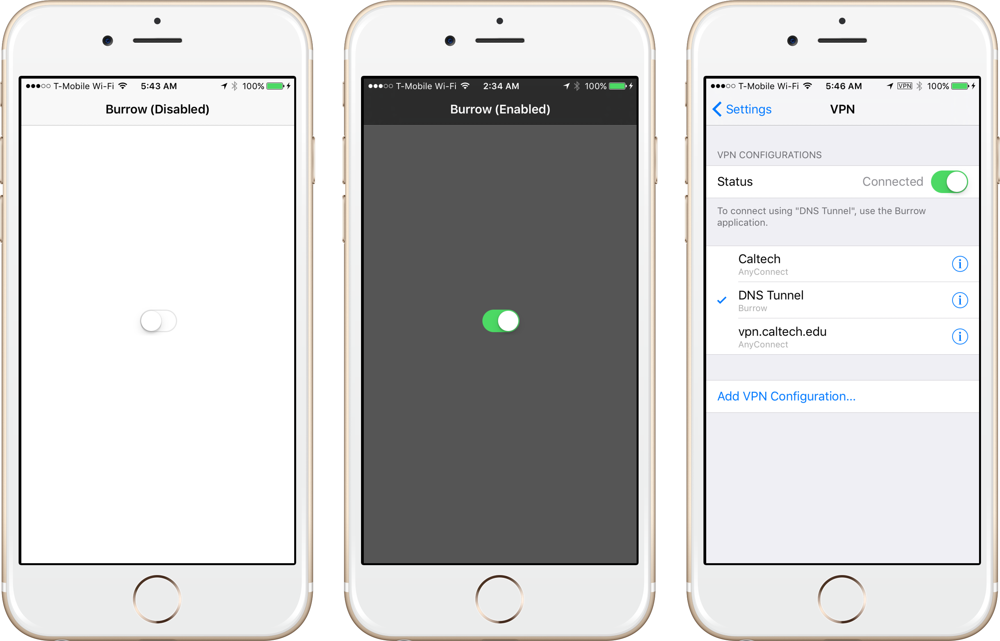
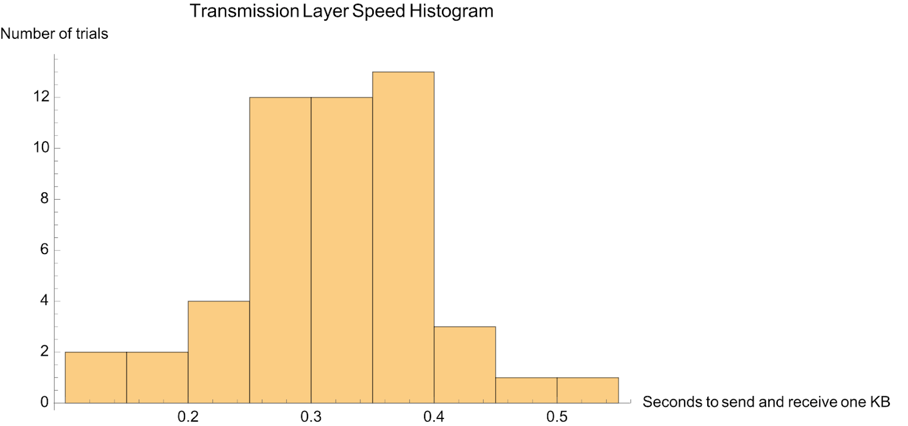
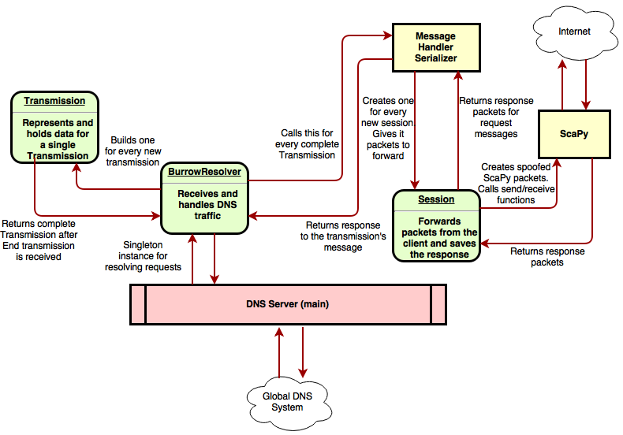
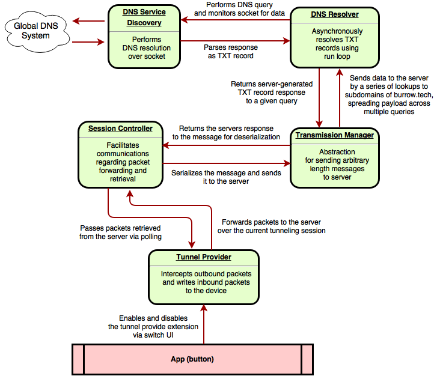

# Abstract

We designed and implemented a service that provides one-tap DNS tunneling to users. To achieve this, we built both an iPhone app and a DNS server that relays user traffic. We received an entitlement to use Apple’s new Network Extension API, and used it to create a one-button app that configures the iPhone’s operating system to tunnel all system traffic over DNS. We designed an abstraction layer for communicating arbitrary amounts of data between a client and a DNS server, and a packet forwarding protocol that is built atop it. We were successful in implementing all of the various components of the system, but were not able to successfully load network resources over the tunnel.

# Introduction

Though the world wide web is meant to be completely open and accessible, this is sometimes not the case when using certain networks that restrict access to the internet. Examples of these restrictions include paywalled WiFi, blocked websites on school networks, and censorship of some or all international sites in countries ruled by oppressive governments. Bypassing these obstacles is commonly achieved by tunneling network traffic around the filtering mechanism to another device that has unrestricted Internet access. This is only possible when the filter or obstacle does not detect that traffic is being routed around it. SSH forwarding and VPNs are common examples of tunneling techniques, but can be detected and due to their prevalence are often blocked. DNS tunneling is an unusual and hard-to-detect method of bypassing network barriers by routing all network traffic through the DNS system. In this project, we investigate the feasibility of creating an easy-to-use DNS tunneling solution for a mobile device.

The biggest and most notable network barrier in use today is China’s Great Firewall. Common tools for circumventing the GFW are proxies, VPNs, and SSH tunneling. Proxies are an unreliable option since they are usually identified and blocked fairly quickly. VPNs use dedicated ports that the government can block completely without disrupting other traffic, and VPN communication with foreign IP addresses can be detected and blocked relatively easily. SSH tunneling used to be a reliable way to bypass the firewall, but the government has been recently cracking down on it. SSH tunneling is encrypted in such a way that the GFW usually cannot determine with certainty if it is tunneling illegal traffic. As a result, the government has recently been preemptively tampering with SSH tunnels that they believe might be performing illegal operations. Thus, the game of cat and mouse continues, and new ways of bypassing these firewalls are necessary.

# Motivation

The DNS system provides a promising alternative to traditional tunneling channels. Tunneling over the DNS protocol is difficult to detect and filter, and information transferred across this protocol is crucial to the functionality of the Internet so it cannot be blocked entirely. Furthermore, tampering with DNS traffic can have major side-effects, and relatively long cache times can result in problems caused by tampered data persisting for long periods of time. Perhaps most importantly, DNS tunneling is currently not commonly used as a way of bypassing Internet filters. As a result, it is usually not worth the complication and expense of applying the advanced statistical monitoring techniques required to detect DNS tunneling traffic and the risk of attempting to block it.

There are a number of DNS tunneling programs available. However, most are designed for use on desktop/laptop computers, while the number of mobile Internet users has been increasing at a breakneck pace since 2007, and in 2014 even exceeded the number of desktop Internet users [7]. Furthermore, most of the existing software requires significant technical skill and resources to configure, including operating one’s own server. The vast majority of Internet users aren’t technically skilled enough to set up their own server and don’t have access to the resources to do so - particularly if they live under an oppressive government. Our goal is to create an iOS app that allows a non-technical user to browse the web through a DNS tunnel, including providing our own managed cloud server to relay data.

# Related Work

DNS tunneling as a topic of interest seems to have first appeared in 1998 [3]. Since it’s not a subject with much commercial value, and it’s far too tricky for your average hobbyist to successfully set up, there’s not much information about it on the Internet.
However, there are a decent number of blog and forum posts floating around, some with snippets of sample code. Most seem to have been written by security professionals interested in the possibility of a virus on an infected system using DNS tunneling to communicate with a C&C server under the radar, and how to defend against such a possibility.
Fortunately for us, even professionals guarding highly valuable systems don’t seem to have come up with any strategies for defeating DNS tunneling that are better than statistical analysis and drastic measures like blocking TXT-type DNS responses completely (which breaks important systems that rely on them, like the SPF anti-spam protocol) [1][8].

As mentioned above, there are a significant number of existing projects that seek to provide semi-turnkey DNS tunneling capability on traditional x86 PC’s. Almost all require that users configure and operate their own server, something we identified as an insurmountable barrier to use by a realistic consumer. A few solutions are available for Android, some even paired with a cloud service like ours [2]. However, no solutions exist for iOS as far as we know (without jailbreaking the device, which we assume is another insurmountable barrier to use by an average consumer).


- DNS2TCP seems to be one of the most robust solutions for tunneling arbitrary data over DNS. Developed by French security researchers. Last updated 2010. http://www.hsc.fr/ressources/outils/dns2tcp/ http://www.hsc.fr/ressources/outils/dns2tcp/download/README https://www.aldeid.com/wiki/Dns2tcp http://tools.kali.org/maintaining-access/dns2tcp
- There is a DNS2TCP package available for jailbroken iPhones. Last updated 2013. http://chug.org/blog/install-dns2tcp-on-ios/ http://planet-iphones.com/cydia/id/dns2tcp https://web.archive.org/web/20150816085011/ http://www.fosk.it/how-to-bypass-firewalls-or-captive-portals-with-dns2tcp.html
- Iodine is the most popular library for DNS tunneling. Open source. Last updated 2015. http://code.kryo.se/iodine/ https://github.com/yarrick/iodine
- There is an Iodine package available for jailbroken iPhones. Last updated 2013. http://blog.thireus.com/dns-tunneling-iodine-0-6-0-rc1-ios-version-ipv4-over-dns-tunnel-on-your-iphoneipadipod-touch
-  OzymanDNS are a client/server pair of simple Perl scripts for DNS tunneling together totaling less than 700 lines of code. Written by Dan Kaminsky for a conference in 2004. http://dankaminsky.com/2004/07/29/51/

We found a few existing applications that use Apple's newly introduced Network Extension API. For example, iCepa uses the API to route all traffic system-wide through the Tor network [6]. On the app store, we found a few VPN apps that use the API to automatically install profiles (with user permission via a system dialog).

# Algorithm Design

To make our protocol easier to reason about, we designed two entirely separate layers of abstraction. The first, which we called the Transmission layer, allows us to communicate arbitrary amounts of data to the server over many DNS lookups and receive an arbitrarily large response. The second, which we called the Session layer and which is built atop the Transmission layer, allows us to forward packets to the server and receive response packets.

## The Transmission Layer

This layer was designed to abstract away the complicated and limited nature of two-way communication between a client and a DNS server. The client can only communicate with the server by looking up DNS hostnames of no more than 255 characters total, split into subdomains of no more than 63 characters each. Accordingly, to send a message larger than 255 bytes to the server our client will have to spread it across multiple DNS lookups. The server can respond to a lookup with up to 64KB of information, which we assume is sufficiently large for our purposes.
Sending a message to the server requires three steps:

1. The client will look up `begin.burrow.tech` and receive a unique ID like `2a591c8b`. To defeat caching of the begin endpoint we have to prefix it with some amount of random data, which is simply ignored by the server. (Although TTL values allow some degree of control over the degree of caching, they are insufficient because values cannot be shorter than 1 second and values less than 60 seconds are routinely ignored.)
2. The client will make several lookups to `continue.burrow.tech` with three arguments: the transmission ID, the index, and ~220 bytes of data. Having an index allows each of the lookups to be resolved in parallel (and received by the server in any order).
3. The client looks up `end.burrow.tech` with two arguments: the transmission ID and the number of `continue` calls that the server should have received. The server verifies that it has received the correct number of `continue` calls, concatenates all of the received data according to the indices, processes it somehow (in our case, hands it off to the Session layer), and returns a result to the client.


    <random>.begin.burrow.tech
        "success=True"; "transmission_id=2a591c8b"
    this_is_some.0.2a591c8b.continue.burrow.tech
    sample_data.1.2a591c8b.continue.burrow.tech
    for_us_to_use.2.2a591c8b.continue.burrow.tech
    3.2a591c8b.end.burrow.tech
        "success=True"; "contents=<______>"


## The Session Layer

This layer encapsulates the packet forwarding and polling logic. Session messages are carried over the Transmission layer. A client sets up a session when it starts the Burrow tunnel and uses it to send and receive packets for the lifetime of the connection. Sending and receiving packets happens in 4 steps:

1. The client begins a session by sending the message `b`. The server will respond with a new session ID like `c8e9471e` and a success code (`s` for success or `f` for failure).
2. The client intercepts some packets and forwards them to the server using the forward packet message syntax: `f-c8e9471e-<packet1>-<packet2>-...`. If the server successfully manages to parse the packets, it will return `s`.
3. The client will periodically poll for response packets from the server with the message `r-c8e9471e` . The server will return any packets it received as responses to previously forwarded packets from this session as `s-c8e9471e-<packet1>-<packet2>-...` 
4. When the client is ready to disconnect, it will end the session with `e-c8e9471e`. The server will clean up the resources used to create the session and return `s`.

```
message: b
response: s-c8e9471e
message: f-c8e9471e-<packet1>-<packet2>-...
response: s
message: r-c8e9471e
response: s-<packet1>-<packet2>-...
message: e-c8e9471e
response: s
```


## Intercepting Client-Side Network Traffic

In 2015, Apple introduced a series of new extension points with iOS 9, most relevantly NETunnelProvider [4]. An app that provides such an extension must include in its code signature a special entitlement from Apple; otherwise, the operating system will prevent the app from using the tunneling extension point. Unfortunately, in a departure from its approach to most past iOS public APIs, Apple is not making the entitlement required to use this extension point available to any developer that requests it [5]. After going through an application process and a lengthy wait, we received permission to build a network extension. This allowed our app to capture and tunnel all system-wide traffic rather than just our own traffic, ensuring the user can safely use all apps on their device.
The NETunnelProvider extension intercepts IP traffic at the network layer, meaning that our app had to be designed for compatibility with both UDP and TCP traffic.

## Performing DNS Requests on the Client

A major challenge in performing DNS requests on the client was working with the networking libraries that iOS provides. We initially used the low-level POSIX API since it provided us the most flexibility, such as the ability to specify a desired layer-4 protocol and nameserver, but its synchronous design proved to be a challenge. We considered switching to the 3rd party getdns API, but it provided difficult to integrate into our iOS application. We finally settled on using Apple’s DNS Service Discovery C API, which is intended for zero-configuration networking (Bonjour) but provides sufficient low level functionality for performing TXT queries and was compatible with iOS’s asynchronous runloop paradigm. Spawning a new thread for each DNS lookup with the POSIX API had huge overhead and introduced race conditions. Transitioning to a runloop-based implementation with the Service Discovery API allowed us to asynchronously resolve queries without the complexity of threading.

## Fulfilling DNS Requests on the Server

The other half of our project is the cloud service that actually accesses the Internet on behalf of our client devices. This is an always-on Debian 7-based dedicated virtual machine. We used Python and the dnslib library to create an DNS server that returns custom responses to lookups for burrow.tech domains. It handles each incoming lookup as a Transmission-layer message, and once it receives a complete Transmission it handles the data as a Session-layer message. To forward packets, we initially tried to use Python’s socket and asyncore modules, as it would allow us to send and receive packets asynchronously. However, we quickly switched to the ScaPy library, which has convenient functions for spoofing packets and recalculating header checksums, and for capturing response packets for outgoing packets. ScaPy’s send/receive function blocks until it finishes sending packets and receiving the answer packets, so to make the server able to resolve more than one packet at a time, we had to make use of Python’s multiprocessing library to create a thread for every call to the send/receive function.


# App Design

The iOS app features a single switch to enable and disable the tunnel. When the switch is enabled, an animation occurs as the UI color changes to indicate connectivity. The user can also quickly enable the tunnel from the system Settings app. A VPN indicator displays in the status bar while tunneling is enabled.



The first time the app is launched, the app requests permission from the user to install a VPN configuration onto the device. The user simply needs to enter their password or use TouchID to authenticate, and then they are really to tunnel. No other setup is necessary.

The app is designed to be very easy to use for users who know nothing about configuring servers. As such, we provide the server, and the user only needs to download the app from the App Store and start using it. The server uses NAT to support multiple users, so each user does not need to set up a server to use the app.

# Performance


This figure shows a histogram of 30 trials of transmitting 1400 bytes to our server directly across the Transmission layer and receiving those bytes back (in reversed order). It’s been normalized to 1KB, and we can see that the average time to transmit 1KB of data to the server and back is approximately 0.4 seconds. This is slow, but a huge improvement from our results when we first got data transmission working (80 seconds) and within the reasonable range of throughputs we expected to achieve.

# Discussion

We had a lot of difficulty finding a suitably powerful API to perform DNS lookups on iOS. Of the APIs that were available, none were written in Objective-C or Swift, so we had to interoperate with low-level C code. Luckily, C functions can be called from Swift, so we were able to interact with these APIs without writing additional code. There were still challenges: namely, C headers cannot be exposed to Swift without first organizing them into a module-map, and though Swift is a high-level language with automatic reference counting and lambdas, we were unable to use these features when working with C code - we had to allocate context structs to store data about run-loop callbacks (rather than using lambdas) and we had to manually manage this memory.

Though we initially used a thread-based concurrency model on the client, we switched to a run-loop implementation to eliminate race-conditions and make the codebase easier to reason about. Instead of jumping between threads in the middle of execution, a run loop involves scheduling tasks to be completed in sequence, over-and-over, for the duration of the program. For example, we’re able to check for new data on a socket during the run-loop and call the appropriate handler.

We built a client library that implemented the Transmission layer protocol for sending arbitrary data to the server. The library originally used callbacks to asynchronously handle responses, allowing us to write non-blocking code even if running on a single thread. We later improved the library to use futures, an abstraction of callbacks. A future represents a value that doesn’t yet exist, but allows you to specify actions to take once it does exist. Further, it allows combinators to be built, such as a future that is only resolved once multiple other futures are resolved.

Our app uses try-catch exception handling to report errors that happen in lower layers of our framework to upper layers. This allows us to handle common error conditions and recovery, for example retrying when a lookup times out. Since the API is asynchronous, we had to design a mechanism to propagate errors through callbacks. We did this by wrapping all callback inputs in a Result type that might contain either the desired result or an error value. This abstraction allowed us to easily propagate errors regardless of where they occur. We even built a mechanism to pass server errors back to the client through this same mechanism. This greatly simplified the debugging process since we were more easily able to determine what went wrong when certain client lookups acted unexpectedly.

As we added more modules to our client app, it became more difficult to understand the logs. Furthermore, we often did not have verbose enough logs to locate an issue, and had to add more on a case-by-case basis. Eventually, we decided to build a logging class that allows us to easily specify the source module and severity of each log message and filter output by these criteria.

We discovered that iOS caps the memory usage of a network extension at only 6 MB and would kill our app if our memory usage exceeded that threshold. Therefore, we had to be careful to not spawn too many threads or attempt to forward too many packets simultaneously, else we’d run out of memory. We addressed this issue by limiting the number of packets being transmitted at once - once we exceed our fixed limit, we stop reading packets from the device hardware until enough of our packets have been received by the server.

Caching was both an issue, and a solution to an issue we had. Since DNS is cached for long periods of time, we had to make sure that the client would never send a DNS lookup that is identical to a previous one. Otherwise, the response would be returned from the cache instead of the server. Caching solved a problem we had with intermediate servers sending a DNS lookup more than once. This caused issues where the server would report an error in response to the second lookup when trying to end a Transmission, since the first lookup had already ended it. However, only the second lookup’s failed response would get sent back to the client. Thus, we decided to cache these responses so that we could return the first lookup’s successful response to the second lookup.

After switching to the DNS Service Discovery API, we soon discovered that some server responses were missing TXT records. This API does not expose the number of records in an answer, so it is not possible to write code that waits until they have all been received. We worked around this issue by always sending an additional TXT record from the server specifying the record count.

We originally planned to transmit our DNS traffic over TCP, and rely on TCP for error correction, retransmission, and in-order delivery. However, we realized that even if our client sent a lookup over TCP to its local DNS server, that intermediate server was likely to perform its recursive lookups over UDP, and there was no way to force it to use TCP. With this constraint in mind, we redesigned our algorithm to not rely on in-order delivery (by adding indices to Transmission continue calls) and to detect dropped lookups (by adding a length to Transmission end calls).

We encountered several concurrency issues on the server side. The first was logging - to avoid logs from different threads being uselessly interleaved, we developed a simple thread-safe logging API to print information to both the console and a file in the order it’s received. The second was ScaPy’s blocking send/receive function, which required us to create a new thread for each packet we send out. The documentation and mailing lists seemed to suggest that there would be resource sharing issues with the network hardware, but we were surprised to encounter no such issues. We did, however, have a consistent problem with send/receive threads never returning (if they never received a response packet) and so had to construct an intermediate timeout thread for each send/receive thread that terminates it after a certain maximum amount of time.

# Conclusions

Our final product successfully intercepts packets on the client and communicates them over the DNS protocol to our server, which spoofs and forwards those packets across the Internet, receives response packets, and returns those packets to the client. We successfully implemented all components of our original plan for this project and they individually work correctly, but unfortunately the integrated product is too slow to successfully forward normal device network traffic. We hypothesize that the transport-layer protocols forwarded by our network-layer tunnel are unable to cope with the multiple-second delay introduced by the DNS protocol, which is not designed to be used in the way we used it. Even disregarding any transport-layer issues, the throughput was sufficiently low that only text-based webpages and perhaps messaging apps would be realistically usable over our tunnel.

In conclusion, we’re confident that we aren’t far off from a fully working prototype and we’re proud to have created a strong technical foundation for our app with clear and efficient layers of abstraction.

# References

[1] http://www.daemon.be/maarten/dnstunnel.html
[2] https://www.vpnoverdns.com/faq.html
[3] http://archives.neohapsis.com/archives/bugtraq/1998_2/0079.html
[4] https://developer.apple.com/library/prerelease/ios/documentation/NetworkExtension/Reference/NETunnelProviderClassRef/index.html
[5] https://developer.apple.com/videos/play/wwdc2015/717/
[6] https://github.com/iCepa/iCepa
[7] http://www.smartinsights.com/mobile-marketing/mobile-marketing-analytics/mobile-marketing-statistics/
[8] http://blog.cloudmark.com/2014/10/07/dns-tunneling-abuses/

# Appendices

## **Server Modules**


**Module Name: **Transmission
**Function: **Implements the Transmission class from the Transmission layer. It holds all the data from a single Transmission, defined by a transmissionID. Its functions are called by the resolver as it receives pieces of a Transmission to add data to the Transmission, and to put together and return the completed Transmission.
Transmission messages come in 3 types. A lookup to <randomdata>.begin.burrow.tech causes the server to create a new Transmission and return a Transmission ID to the client. A lookup to <transmission_ID>.<index>.continue.burrow.tech contains data that is added to the Transmission. A lookup to <# of pieces>.<transmission_ID>.end.burrow.tech means that the Transmission data is put together, and handled as part of a Session. The Session returns a reply that is sent to the client.
**Authorship: ** Alex
**Language: ** Python
**Workload: ** ~60 lines
**Possible Failure Conditions: **If it receives a Transmission that is not one of the Transmission types, it will report an error. If it receives a .end call before receiving all of the .continue calls for that Transmission, it will raise an error.

**Module Name: **Burrow Resolver
**Function: **Implements the DNS resolver of the server. It handles DNS requests from a client on the Transmission layer. It is used to receive DNS requests to the server. It determines what type of transmission the DNS request is, and handles it accordingly, sending back a success or failure message for each piece of a Transmission it receives. Once it receives an end Transmission, the then sends the complete Transmission to the Session layer to get a reply. It then constructs any responses as a TXT record and sends it back to the client. It provides caching of responses in case intermediate DNS servers send a lookup to the server multiple times.
**Authorship: ** Alex, Jaden
**Language: ** Python
**Workload: ** ~300 lines
**Possible Failure Conditions: **If it receives a .continue or .end call with a Transmission ID that does not exist or was ended too long ago, it will return an error to the client.

**Module Name: **Session
**Function: **Implements the packet forwarding component of a Session. A Session itself is a packet forwarding session that sits on top of the Transmission layer. The client sends the server a number of packets and queries the server for response packets in a Session. This class uses ScaPy to spoof and forward packets. Each session sends and receives packets on a unique port. It sends a number of packets and holds the responses until the client asks for packets from the Session.
**Authorship: ** Alex, Mimi
**Language: ** Python
**Workload: ** ~60 lines
**Possible Failure Conditions: **It only forwards TCP and UDP IP packets. Any other packets will result in an error. If it runs out of ports to forward packets on, it will also return an error, but this should never happen unless sessions are not being ended properly.

**Module Name: **Serialized Message Handler
**Function: **This handles messages from the client by delimiting the message string using dashes and getting the first item in the message, which is the type. It calls the appropriate handler based on the message type. A Begin message causes it to return a Session ID and create a new instance of a Session. A Forward message contains packets that are forwarded using its Session. A Request message queries the Session for response packets to the forwarded packets. An End message closes the Session and frees up the port.
**Authorship: ** Mimi, Alex
**Language: ** Python
**Workload: ** ~70 lines
**Possible Failure Conditions: ** If it receives a Session that is not one of the Session types, it will report an error. Otherwise, if it receives an end session to a session ID that does not exist, it will return an error to the client. It will also pass errors from Session on to the client.

**Module Name: **Burrow Logging
**Function: **This module allows our server-side code to quickly and easily log to both stdout and a logfile from multiple files and multiple processes/threads simultaneously. It’s fully thread-safe, taking advantage of Python’s multiprocessing library to queue log events. It also allows us to easily define a LOG() function in each file that sets the default indentation level of logs from that file, making the output easier to parse across different layers of abstraction.
**Authorship:** Alex
**Language:** Python
**Workload:** ~30 lines
**Possible Failure Conditions:** N/A

**Module Name: **Server run script and configuration
**Function: **We obtained a domain name and configured it to use our own nameserver (with some difficulty, most registrars seem to assume their customers will take advantage of the free DNS service they provide). Since code had to be running on the actual nameserver for our domain in order to be tested, only one person could work on the server code at a time. To ensure more than one person wouldn’t try to modify the code on the server at the same time, we configured the server to only allow one SSH login at a time. And to enable quick iteration, we developed a simple bash script wrapper for the server that restarts it any time files are changed.
**Authorship:** Alex
**Language:** Bash
**Workload:** ~30 lines
**Possible Failure Conditions:** N/A

**Module Name: **dnslib
**Function: **** **Used for all DNS-related functions, including listening for, parsing, and replying to DNS requests.
**Authorship:****  **Paul Chakravarti
**Language: ** Python
**Workload: ** N/A
**Possible Failure Conditions: **N/A

**Module Name: **ScaPy
**Function: **Used to spoof the source IP address and port in packets received from a client, to send the spoofed packets out on the network, receive the replies, and then un-spoof the replies so that their destination is the client.
**Authorship: **  SecDev (Philippe Biondi)
**Language: ** Python
**Workload: ** N/A
**Possible Failure Conditions: **N/A


## **Client Modules**


**Module Name: **App
**Function: **The app UI features a switch that is used to activate and deactivate the DNS tunnel. When activated, system-wide traffic is intercepted by our tunneling extension and sent through the server. The app code also configures the extension and uses basic animations to make the tunnel state clear.
**Authorship: ** Jaden
**Language: ** Swift
**Workload: ** ~150 lines
**Possible Failure Conditions: **Reports an error if it is unable to configure the tunnel provider. For example, if the user does not give Burrow VPN permissions, the app will be unable to configure the tunnel provider.

**Module Name: **Burrow Tunnel Provider
**Function: **Subclass of NETunnelProvider that utilizes the Session Controller module to set up and tear down a tunneling session in response to system events. While the extension is running, the tunnel provider will read packets from the device and forward them over the tunnel using the session controller with each run loop iteration. Further, the tunnel provider will implement the session controller delegate method to handle received packets and inject them into the device.
**Authorship: ** Jaden
**Language: ** Swift
**Workload: ** ~150 lines
**Possible Failure Conditions: **Receives errors from the session controller and propagates them upwards.

**Module Name: **Session Controller
**Function: **Handles the logic of communicating with the session layer on the server. Specifically, serializes messages and deserializes response from the server, sends messages over the transmission layer, and polls the server for packets ready to be sent back to the client, notifying the extension via a delegate method. Also handles tearing down server session once the client is finished tunneling.
**Authorship: ** Jaden
**Language: ** Swift
**Workload: ** ~400 lines
**Possible Failure Conditions:**
*Deserialization error:* The sever returned a response with either invalid formatting or invalid contents. *Server error:* The server was unable to fulfill a client request, and responded with an error message indicating unknown message type, unknown session id, or some undefined error.

**Module Name: **Transmission Manager
**Function: **This is the client’s complement to the server’s Transmission layer. It sends arbitrary data to the server by breaking the data up into domain name sized chunks, and encoding it in Base64. It will query <garbage>.begin.burrow.tech to begin a Transmission and get a Transmission ID, then send the data over multiple queries to continue.burrow.tech using the Transmission ID and the index of the chunk of data being sent. After the whole Transmission has been sent, it will query <# of pieces>.<transmission_ID>.end.burrow.tech. It uses the DNS resolver to perform the queries.
**Authorship: ** Jaden, Mimi
**Language: ** Swift
**Workload: ** ~230 lines
**Possible Failure Conditions:**** **Throws an error if it is unable to handle a given TXT record. Reasons include unexpected server response, server failure response, and transmission timeout. Also propagates DNSResolver errors upwards.

**Module Name: **DNS Resolver
**Function: **Provides a high level API for asynchronous DNS resolution using the run loop rather than threads. This prevents a whole class of concurrency bugs that might’ve existed in our previous threaded implementation. Built on top of the low level DNS Service Discovery C module, this API returns a Future that will be executed when the DNS lookup resolves successfully. The Transmission Manager uses this class to encode messages to the server as DNS lookups, receiving TXT record responses. This API also handles collecting multiple TXT record responses from the server and returning them together to the caller. Further, it exposes methods for parsing TXT records into attribute dictionaries.
**Authorship: ** Jaden
**Language: ** Swift
**Workload: ** ~350 lines
**Possible Failure Conditions: **Throws an error if it cannot parse the TXT record. Also propagates DNS Service Discovery errors upwards.

**Module Name: **DNS Service Discovery
**Function: **DNS Service Discovery is an Apple API for discovering services over DNS. It is built as a C API, but we created a module-map to expose it to Swift. We ignore it’s service features and simply use it to resolve DNS lookups. Since it exposes the socket used by the lookup, we can wait until the socket is ready to read. This can be done asynchronously using a run loop event source. Note that we previously used the `lib resolver` API, but it blocked on DNS resolution, and spawning a new thread for each DNS lookup was bug-prone and inefficient.
**Authorship: ** Apple (modularized by Jaden)
**Language: ** C
**Workload: ** N/A
**Possible Failure Conditions: **OS-level failure conditions such as out of memory or no network connectivity https://developer.apple.com/library/ios/documentation/Networking/Reference/DNSServiceDiscovery_CRef/#//apple_ref/doc/constant_group/DNS_Error_Codes

**Module Name: **Logger
**Function: **Provides the capability to easily log messages with differing severities and later filter messages by module and severity. Each module or file can create a log object specific to itself such that all logs generated by this code will be labeled with the category. Each log is either an error, a warning, an info message, a debug message, or a verbose message. We can set our desired severity for each module such that only useful logs will print to the console. This makes debugging much easier since we don’t need to sift through unrelated messages. Further, it allows use to easily obtain more info about what’s happening when we observe a problem in a specific module.
**Authorship: ** Jaden
**Language: ** Swift
**Workload: ** ~100 lines
**Possible Failure Conditions: **N/A

**Module Name: **Future (Promises)
**Function: **Used instead of callbacks throughout the project in order to simplify the logic. Previously, it was easy to forget to call a callback on a certain code path, so we built this module to ensure correctness in our code. Further, it allows use to built combinators that operate on our callbacks. For example, we can build a callback that will only be called once all of its dependencies are called. This is useful in the Transmission Manager since we want to wait until all continue responses have been received before we send the end message.
**Authorship: ** Jaden
**Language: ** Swift
**Workload: ** ~150 lines
**Possible Failure Conditions: **N/A

